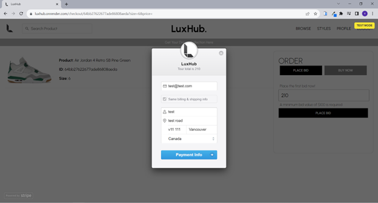

# LuxHub

This is a course project created by @winghojackyli and @veronicacheng2 in Summer 2023.

LuxHub is a MERN web application designed for buying and selling sneakers, apparel, accessories, and more. It provides a platform for users to place bids and asks for various products and keep track of their prices. Whether you're a sneaker enthusiast or a fashion aficionado, LuxHub offers a seamless experience for trading luxury items.

## Demo

Check out the live demo of LuxHub: [LuxHub Demo](https://luxhub.vercel.app/)

## Table of Contents

- [Installation](#installation)
- [Features](#features)
- [Screenshots](#screenshots)

## Installation

You can run LuxHub locally by following these steps:

1. Clone the repository:

```
git clone https://github.com/your-username/luxhub.git
```

2. Open 2 terminals and navigate to the frontend and backend directories respectively:

```
cd client
```

```
npm install
```

```
cd api
```

```
npm install
```

3. You will need to create .env and fill in the following variables for both backend and frontend:

   - For backend: MONGO_URL, PASS_KEY, JWT_KEY, STRIPE_KEY

   - For frontend: REACT_APP_STRIPE

4. Start the backend and frontend concurrently:

```
npm start
```

5. The application should now be accessible at http://localhost:3000.

## Features

LuxHub offers the following features:

- User authentication and registration.
- Placing bids and asks on products.
- Editing/Deleting bids and asks
- Browsing products by category.
- Searching products by name or brand
- Filtering products based on various criteria.
- Viewing price charts for products.
- Viewing active bids and asks for products
- Viewing posts created by admin (posts are mainatined by admin, and only admin can create, edit or delete posts)

## Screenshots

### Home Page

1.  Slider showing featured products.
    
    <br />
2.  Direct links to popular brands and section showing latest releases.
    
    <br />
3.  Bestsellers section which shows the products that have highest number sold.<br /> <br />Newsletter section which allows user to subscribe to LuxHub email list by entering email.


### User Registration Page


### User Sign-in Page


### Browse Page

1. Browse page shows all the available products, user can search, filter and sort the product catalogue.
   
<br />
2. User can search products with the search bar at the top left corner, this screenshot shows the results for searching “nike” products
   
<br />
3. User can apply filters and sort for products category, this screenshot shows the result of applying ‘shoes’ and ‘adidas’ filter and sorting by ‘popularity’:
   
<br />
### Product Details page

1. User can see the product details such as release date, number sold last sale by clicking the product box
   
<br />
2. User can view all active bids for the product by clicking ‘View All Bids’ button
   
<br />
3. User can view all active asks for the product by clicking ‘View All Asks’ button
   
<br />
4. By selecting the size, user can view the highest bid and lowest ask for the size. <br /> <br /> In this screenshot, highest bid is $150 and lowest ask is $260 for size 8 Air Jordan 4 Retro SB Pine Green
   

### Placing a Bid

1. User can place a bid on the product by clicking ‘BID or BUY’ button
   <br/><br/>After inputting the bid value, user needs to fill in payment information. (For testing purpose, please fill in ‘4242 4242 4242 4242’ for card numbers, and for month value please fill in current month or at least one month later than the current month.)
   
<br />
2. Bid has been created.
   

### Placing an Ask

1. User can place an ask on the product by clicking ‘ASK or SELL’ button.
   
<br />
2. Ask can be created after clicking ‘PLACE ASK’ button and inputting the ask value
   

### Special Case: Placing a bid that is higher than the lowest ask

1.  The lowest ask is $200 for size 8, we attempt to place a $220 bid
    
    <br />
2.  A modal will pop out and remind the user that he can buy the product at $200 instead of $220
    

### Special Case: Placing an ask that is lower than the highest bid

1. The highest bid is $350 for size 9, we attempt to create an ask of $330.
   
<br />
2. A modal will pop out and remind the user can sell the product at $350 instead of $330
   

### User Profile Page

1. User can change profile information.
   
<br />
2. User can view bids history, edit the bid price or delete the bid.
   
<br />
3. User can view asks history, edit the ask price or delete the ask.
   
<br />
4. User can view buying order history and selling order history in “Orders” tab.
   

### Styles Page

1. User can browse the posts created by admin.
   
<br />
2. User can navigate to the “Product Details Page” by clicking the product name shown under the image.
   

### Admin Login

1. Admin can create new product by clicking the create button on “Browse” page.
   
   
<br />
2. Admin can edit/delete the product on “Product Details” page.
   
   
<br />
3. Admin can create, edit or delete new post on “Styles” page.
   
   
